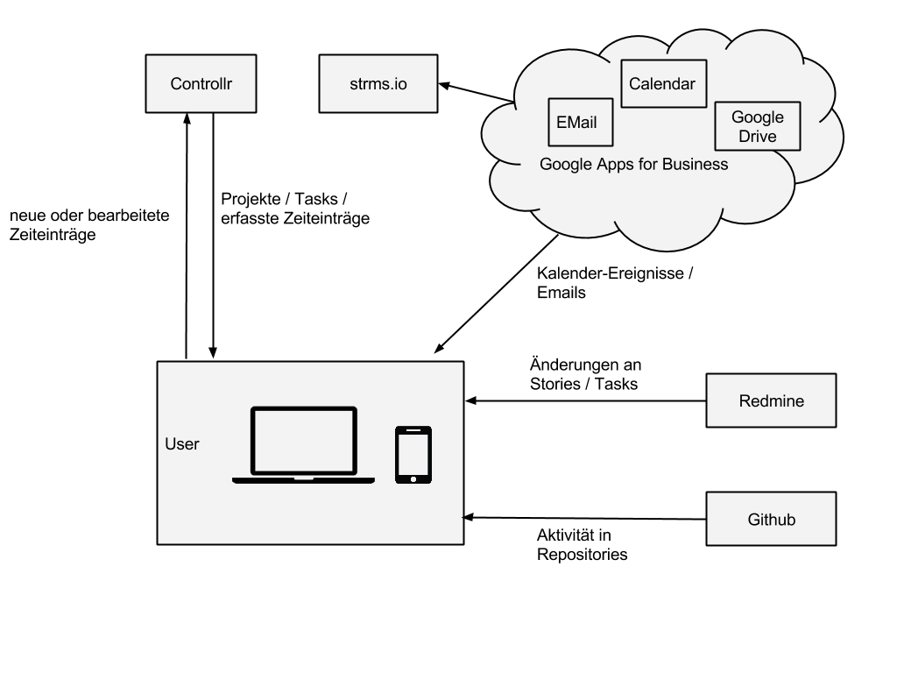

\newpage

#Ist-Analyse

## Ausgangslage

Jeder Mitarbeiter muss regelmässig seine gearbeitete Zeit in der Anwendung "Controllr" eintragen. Dabei wird unter anderem die gearbeitete Zeit, das zugehörige Projekt, ein Task-Typ und eine Beschreibung angegeben.

Diese Tasks müssen am Ende eines Monats bestätigt werden, damit eine Auswertung stattfinden kann.

Die Anwendung ist als Webbasierte Lösung implementiert und ist für die Benutzung am Computer ausgerichtet, funktioniert prinzipiell aber auch auf kleineren Smartphones und Tablet-Computer. Dabei wurden die Elemente bei wenig Platz untereinander angeordnet. Die Eingabe-Elemente bleiben unangetastet.

Die Erfassung eines Zeiteintrages erfordert folgende Interaktionen:

- Auswahl eines Tages durch klick auf einen kleinen Kalender.
- Auswahl eines Projektes durch ein *Select*-Element
- Auswahl eines Tasks durch ein *Select*-Element
- Eingabe der Startzeit im Format hh:mm
- Eingabe der Endzeit im Format hh:mm
- Eingabe eines Beschreibungstextest
- Bestätigung durch Klick auf "Create Entry" 

Weitere Einzelheiten sind unter Abschnitt \ref{secControllr} zu finden.

Jedem Mitarbeiter stehen weitere Systeme zur Verfügung, welche er in seiner täglichen Arbeit benutzen kann (Siehe Abschnitt \ref{secSysteme}). Vieler dieser Systeme können über Schnittstellen ausgewertet werden um beispielsweise die Aktivität eines Benutzers auszuwerten

##Rollen

Ein zentraler Aspekt der Arbeit sind die erwähnten Kontext-Daten der Benutzer, doch nicht jeder Mitarbeiter hat die gleiche Art von Kontext. Ein Entwickler “dokumentiert” seine Arbeit häufig in einer Code-Versionisierungs-Software, für einen Projektleiter jedoch stehen Meetings und entsprechende Kalender-Einträge im Vordergrund. Eine vorgängige Analyse der Rollen und verfügbaren Systemen ist daher unabdingbar. 

Nachfolgend eine Liste der Rollen, welche bei Panter vertreten sind. Manche Mitarbeiter nehmen mehrere Rollen ein. Manche Mitarbeiter arbeiten zudem häufig extern bei Kunden und nutzen teilweise andere Systeme.
Software-Engineer
Konzipiert, erstellt, testet und wartet Anwendungen und Systeme. Arbeitet häufig im Team in einem agilen Entwicklungsprozess (häufig Scrum).

Scrum-Master
:	Leitet und überwacht den Scrumprozess. Er plant und moderiert häufig die Scrum-Meetings, wie Planning-Meeting und Daily Scrum-Meetings, sowie andere Scrum-Aktivitäten.

Product Owner-Assistent
:	Der Product Owner-Assistent (PO-Assistant) wird dem häufig externen Product Owner zur Seite gestellt und unterstützt diesen beim Erstellen und Abnehmen der User Stories. 

Sales
:	Sales-Mitarbeiter beraten bestehende Kunden und potentielle neue Kunden über neue Projekte und nehmen an Pitches teil.

Administration
:	Kümmert sich um Buchhaltung, Administation und Human Resources-Aufgaben.

Marketing
:	Erstellt und setzt das Marketing-Konzept der Firma um, fördert die Sichtbarkeit der Firma und unterstützt dadurch die Bestrebungen der Sales-Mitarbeiter.

Community-Manager
:	Kümmert sich um die Verwaltung des Cowork-Space “colab-zurich.ch”. Zur Zeit (Ende 2014) eine Praktikumsstelle.

\pagebreak

##Systeme\label{secSysteme}

Den Mitarbeitern stehen in der Regel folgende Systeme und Anwendungen zur Verfügung, sofern sie nicht im externen Einsatz eingschränkt sind:

###Controllr\label{secControllr}

Von Panter erstellte Software für das Finanz-Controlling, Zeiterfassung und Resourcenplanung. Es ist das zentrale System, welches die Anwendung anbinden soll. Zugriff erfolgt über ein Webinterface oder über eine REST-Schnittstelle.

####Zeiteinträge

Die REST-Schnittstelle von Controllr ermöglicht unter anderem das Lesen und Manipulieren von Zeiteinträgen, Projekten und Tasks. Im Listing \ref{lstcontrollrentries} sind die Schnittstellen zu den Zeiteinträgen zu sehen. Diese Schnittstellen dienen zum Lesen (GET), Erstellen (POST), Bearbeiten (PUT / PATCH) und Löschen (DELETE) von Zeiteinträgen. Listing \ref{lstcontrollrentriesresult} zeigt das Schema eines solchen Zeiteintrages. 

~~~~{caption="Controllr REST API für Zeiteinträge" label=lstcontrollrentries}
GET      /api/entries(.:format)                          
POST     /api/entries(.:format)                          
GET      /api/entries/new(.:format)                      
GET      /api/entries/:id/edit(.:format)                 
GET      /api/entries/:id(.:format)                      
PATCH    /api/entries/:id(.:format)                      
PUT      /api/entries/:id(.:format)                      
DELETE   /api/entries/:id(.:format)
~~~~

~~~~{caption="Schema von /api/entries" label=lstcontrollrentriesresult}
{
	"id": 12513,
	"created_at": "2014-09-15T14:25:07.000Z",
	"updated_at": "2014-11-13T14:45:31.000Z",
	"deleted_at": null,
	"day": "2014-09-15",
	"start": "2000-01-01T09:50:00Z",
	"end": "2000-01-01T10:00:00Z",
	"duration": 10,
	"state": "invoiced",
	"description": "Standup Meeting",
	"billable": true,
	"invoice_id": 123,
	"project_id": 1100,
	"task_id": 10042,
	"user_id": 12,
	"project_shortname": "abc-001",
	"task_name": "Internal Meeting",
	"user_username": "maw"
}
~~~~

Auffallend ist “start” und “end”, bei denen das Datum offenbar aus Formatgründen angefügt wird und ohne Relevanz ist. Lediglich die Zeit ist relevant. Für das Datum des Zeiteintrages ist “day” relevant. Dies bedeutet auch, dass jeder Zeiteintrag einem Tag zugeordnet ist, es kann keine einzelnzen Zeiteinträge geben, die über mehrere Tage gehen (z.b. über Mitternacht). 

Manche relationale Daten sind zudem Denormalisiert (project_shortname und task_name).[^fnDenormalisiert]

[^fnDenormalisiert]: Als Denormalisierung bezeichnet man das bewusste Einfügen redundanter Informationen einer relationalen Datenbank zu Gunsten eines besseren Laufzeitverhaltens oder einfacherem Zugriff. Im obigen Beispiel, wird neben der project_id auch der project_shortname mitgegeben, welcher direkt abhängig von der project_id ist. Das Denormalisieren entspricht der Umkehrung der Normalisierung. 

Der Lesezugriff (GET) auf diese Daten liefert jeweils ein Array dieser Einträge. Mit GET-Parameter können die Resultate gefiltert werden:

date_to, date_from
:	Liefert die Einträge mit “day” zwischen date_from und date_to (inklusive)

employee_usernames
:	Liefert nur die Einträge eines bestimmten Users

project_shortnames
:	Liefert nur die Einträge eines bestimmten Projektes

states
:	Liefert nur Einträge mit einem bestimmten state

#### Projekte

Projekte können über die Schnittstellen von Listing \ref{lstControllrProjects} abgerufen werden und liefern ein Array von Projekten wie im Schema \ref{lstcontrollrProjectsResult}

~~~~{caption="Controllr REST API für Projekte" label=lstControllrProjects}
GET      /api/projects(.:format)                         
GET      /api/projects/:id(.:format)   
~~~~

~~~~{caption="Schema von /api/projects" label=lstcontrollrProjectsResult}
{
	"id": 1234,
	"shortname": "abc-001",
	"description": "Beispiel Projekt",
	"start": "2014-03-21",
	"end": "2014-11-13",
	"created_at": "2014-04-07T10:15:11.000Z",
	"updated_at": "2015-02-06T17:50:39.000Z",
	"project_state_id": 6,
	"probability": "1.0",
	"deleted_at": null,
	"external": true,
	"note": "Dies ist ein Beispielprojekt",
	"worktime_budget": "1302.0",
	"cached_expected_profitability": 0.581247,
	"cached_expected_return": 685.5,
	"company_id": 111,
	"active": true,
	"leader_id": 62,
	"business_unit_id": 1,
	"cached_budget": "112236.0",
	"budget_notification_sent": false,
	"mwst": true,
	"daily_rate": "1200.0",
	"hours_per_day": "8.0",
	"google_id": "Gyqrt64o8AOywyeBGyqrt64o8AOywyeB",
	"planning_note": "",
	"time_billable": "1255:43",
	"burned_time": "1301:47"
}
~~~~

#### Tasks

Die Tasks-Schnittstelle wird in Listings \ref{lstControllrTasks} und \ref{lstcontrollrTasksResult} beschrieben. 

Es existieren noch weitere Schnittstellen, welche aber für die Arbeit weniger relevant sind.

~~~~{caption="Controllr REST API für Tasks" label=lstControllrTasks}
GET      /api/tasks(.:format)                            
GET      /api/tasks/:id(.:format)   
~~~~

~~~~{caption="Schema von /api/tasks" label=lstcontrollrTasksResult}
{
	"id": 6711,
	"name": "Freelance vor Ort",
	"project_id": 3330,
	"created_at": "2011-11-24T19:02:08.000Z",
	"updated_at": "2011-11-24T19:07:23.000Z",
	"active": true,
	"deleted_at": null,
	"billable_by_default": true,
	"worktime_budget": null,
	"global_task_id": null,
	"daily_rate": null
}
~~~~

#### Authentifizierung

Für die Authenfizierung des Users muss ein Token (user_token) an die Schnittstellen mitgegeben werden. Der Token kann auf der Profil-Seite im Controllr abgefragt werden, nachdem man sich eingeloggt hat.

### Google Apps

Für Email, Kalender und Dateien wird Googles Business Angebot “Google Apps” verwendet. Der Service kann über verschiedene REST-APIs abgefragt und bedient werden. Da Implementationen dieser Schnitstellen in vielen Sprachen bereits existieren, bietet es sich an, manche dieser Schnittstellen zu verwenden.

#### Email
Business-Variante von Googles Mail-Lösung GMail. Die Anwendung wird im Browser bedient und kann zudem über eine REST-API abgefragt werden. Es können insbesondere Nachrichten, Threads (Zusammengehörende Nachrichten) und Labels abgefragt werden. Siehe [@gmailApi].

Möglich wäre beispielsweise, Nachrichten nach Projekt-Namen aus “Controllr” zu durchsuchen und diese als Quelle zu verwenden. 

#### Kalender

Kalender-Anwendung von Google. Wird in der Firma häufig verwendet und kann ebenfalls über eine REST-API abgerufen weren. Kalendereinträge bieten sich insbesondere an, da diese bereits über ein ähnliches Format verfügen wie die Zeiteinträge; sie haben u.a. eine Start- und Endzeit, sowie eine Beschreibung. [@calendarApi].

#### Authentifizierung

Die Authentifizierung wird OAuth 2.0 verwendet. Es existieren zahlreiche Implementierungen dieses Standards, was die Verwendung dieser Schnittstellen vereinfacht. [@googleOAuth2]

### Redmine

Projektverwaltungs-Anwendung, welche von der Firma für viele Projekte verwendet wird. Die Projekte werden stets in einem agilen Prozess entwickelt, welcher meistens SCRUM ist. In Redmine befinden sich daher Stories und zugehörige Tasks, sowie deren Stand. Mitarbeiter, welche an externen Projekten beim Kunden arbeiten, verwenden allerdings häufig nicht Redmine, sondern jeweilige Firmen-Interne Anwendungen.

Redmine bildet nicht direkt typische SCRUM-Artefakte wie Stories und Tasks ab, sondern es werden üblicherweise “Issues” erfasst. Über Erweiterungen können aber Stories und Tasks ebenfalls erfasst werden, diese werden dann als unterschiedliche “Issue”-Typen erfasst.

Redmine bietet ebenfalls eine REST-API, welche es u.a. erlaubt, Issues und Projekte abzufragen. [@redmineApi]

#### Authentifizierung

Für die Authentifizierung muss ein fester Token mitgegeben werden, welcher User-spezifisch ist und auf der Profil-Seite von Redmine abgefragt werden kann.

### Github

Verwaltungsoberfläche und Hosting-Dienst für Software-Projekte, welche die namensgebende Quellcode-Versionsverwaltungs-Software git verwendet. Nicht alle Projekte verwenden Github für die Quellcode-Versionisierung. Insbesondere externe Projekte beim Kunden verfügen über eigene Versionisierungstools.

Github verfügt ebenfalls über reichhaltige REST-APIs; die Beschreibung dieser APIs kann in der Quellenangabe eingesehen werden. Es bietet sich an, die Schnittstelle “Events” zu verwenden, welche beispielsweise Aktivitäten eines Benutzers aufzeigt. Damit kann die Tätigkeit eines Users auf Github an einem Tag abgefragt werden. Die Art der Aktivität und das Repository sind dabei zweitrangig. (https://developer.github.com/v3/)

Ein solches Event verfügt über einen Typ, eine Beschreibung, eine Identifizerung des Repositories und einen Zeitpunkt, an dem dieses Ereignis oder Aktivität stattgefunden hat.

#### Authentifizierung

Github unterstützt verschiedene Authentifizierungsverfahren: Basic Authentication mit Username / Password, OAuth2 mit Token oder OAuth2 mit Key/Secret , siehe [@githubAuth].

### Timetunnel

Der Timetunnel ist eine von Panter entwickelte Software, welche es ermöglicht, Zeiteinträge direkt über den Kalender zu tätigen. Die Software besteht im wesentlichen aus einem Script. welches Kalendereinträge mit definierten Stichworten im Titel sucht und als Zeiteinträge für die Zeiterfassung in Controllr erfasst. Das bedeutet, Zeiteinträge können direkt im Kalender erfasst, statt im Web-GUI. Die Anwendung wird nach erster Abklärung kaum genutzt, allerdings können Ideen davon, wie z.b. das Tagging der Einträge wiederverwendet werden.

### strms.io (vormals storyline.li)

Sich in Entwicklung befindende Software, welche von Panter entwickelt wird. Die Anwendung konsolidiert verschiedene Google-Dienste wie Email, Kalender und Google Drive und stellt die Aktivitäten eines Benutzers auf diesen Diensten chronologisch dar. Ziel ist es, Emails, Kalendereinträge und Dateien in einen Zusammenhang zu bringen. Die Anwendung bietet sich als Datenquelle an, weil sie bereits mehrere Quellen vorkonsolidiert und chronologisch ordnet. Das Projekt befindet sich zum Zeitpunkt dieser Arbeit in Entwicklung. Eine Zusammenarbeit, sowie Wissensaustausch ist möglich. Es existieren allerdings zum Zeitpunkt der Entwicklung dieser Arbeit keine Schnittstellen, welche einen programmatischen Zugriff erlauben.

### Systemübersicht

Abbildung \ref{figSystems} zeigt eine Übersicht der Syteme und eine mögliche Integration der zu erstellenden Applikation.

