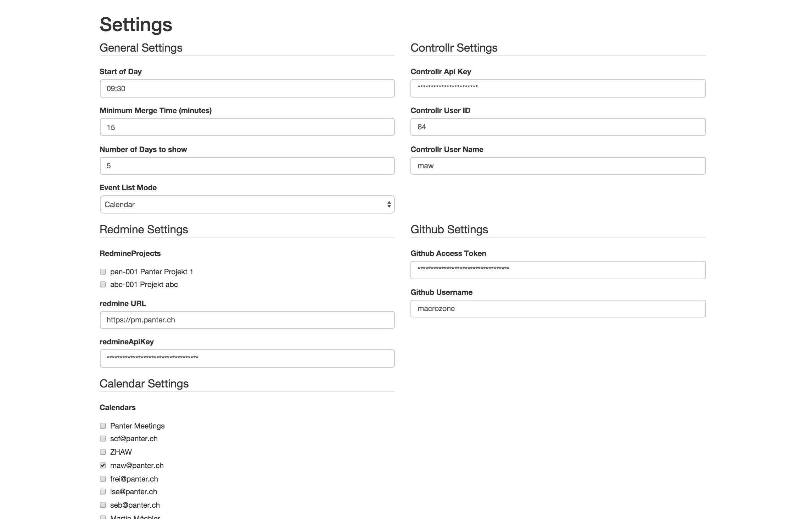
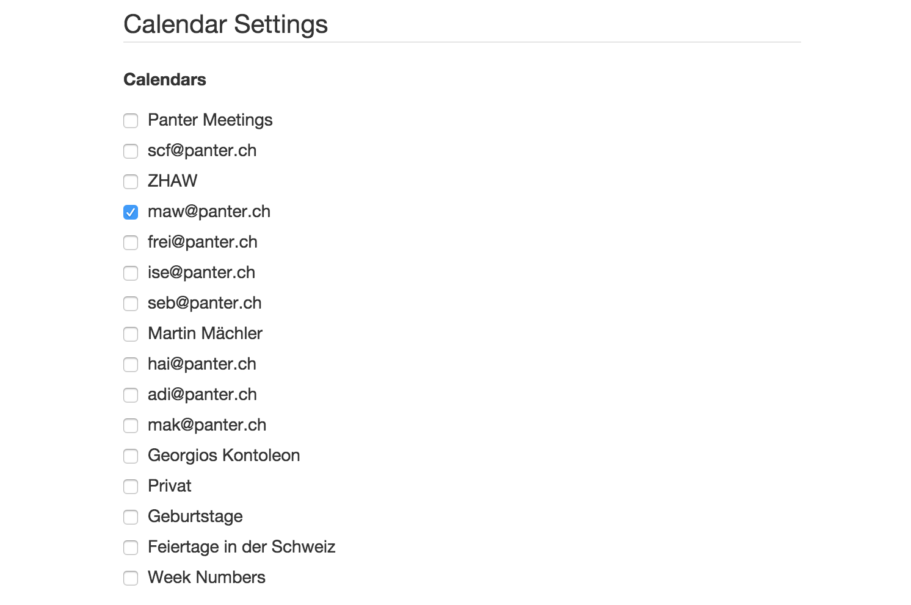

\newpage

# Umsetzung Prototyp

## Technologie-Wahl

Für die Umsetzung wurde zwischen nativer Entwicklung auf einer mobilen Plattform wie IOS, Android oder Windows Phone und zwischen einer Webapplikation entschieden, welche plattformunabhängig läuft.

Da die Umfrage unter den Mitarbeitern ergeben hat, dass beide Plattformen signifikant vertreten sind, fiel die Wahl auf eine Webapplikation. Da manche Mitarbeiter eine dedizierte Smartphone-Applikation in der Umfrage abgelehnt haben, ist eine Webapplikation ebenfalls zu bevorzugen, da sie auch am Desktop-Computer, Notebook, Tablet oder ähnlichem benutzt werden kann.

## Meteor 
Die Webapplikation wurde unter Meteor entwickelt, einem “Full-Stack”-Webframework[^fnFullStack] in Javascript. Meteor basiert auf einem reaktiven Programmierparadigma und löst Client-Server-Kommunikation und Data-Binding[^fnDataBinding] auf eine einfache Weise, was den Code sehr expressiv macht und der Fokus auf die Umsetzung des zu lösenden Problem gesetzt werden kann. Für eine Konzeptarbeitet hat dies entscheidende Vorteile.

Im September 2014 wurde das Build-Tool von Meteor erweitert, sodass auf eine einfache Weise Phonegap/Cordova-Container-Applikationen erstellt werden können. Diese Art von Applikation bündelt eine Webapplikation in einer nativen Applikation und kann in den Apple App Store, im Google Play-Store oder den Windows Store gestellt werden. Auf der jeweiligen Plattform erscheint sie als normale Anwendung. In Anbetracht des Themas “Entwicklung für Handheld” ein zusätzlicher, sinnvoller Exkurs. [@meteorCordova]

[^fnFullStack]: “Full-Stack”-Frameworks decken alle Schichten einer typischen Webapplikation ab, d.h. vom Client bis zum Server. Häufig können sie dadurch die Datenverbindung vom Client zum Server abstrahieren.

[^fnDataBinding]: Data-Binding bezeichnet das Verfahren, das User Interface (UI) einer Applikation derart an deren Business Logic (BL) zu koppeln, das Änderungen an der BL auf das UI reflektiert werden und umgekehrt

## Sprache

Meteor wird in JavaScript geschrieben, unterstützt aber auch diverse JavaScript-Dialekte, wovon CoffeeScript für die Umsetzung gewählt wurde. Ausschlaggebend dafür war die schlankere Syntax, die bessere Lesbarkeit, sowie syntaktische Erweiterungen und Abkürzungen ("Syntactic sugar"). [@meteorCoffee;@coffeescript]

## Authentifizierung

Meteor stellt ein einfaches Login-System über OAuth zur Verfügung, es können Google, Facebook, Github und weitere als Login-Provider definiert werden. Es wurde Google als Login-Provider gewählt, damit können auch die Firmen-Logins verwendet werden. Ist die Authentifizierung auf Google erfolgt, können verschiedene Google-APIs abgerufen werden, im Speziellen die Kalender-API, welche hier verwendet wurde.

Für die Authentifizierung gegenüber Github, Redmine und der Controllr-Applikation muss allerdings ein “Access-Token” in der jeweiligen Anwendung erstellt und einmalig in der Anwendung dieser Arbeit gespeichert werden. Für diesen Zweck und weitere Einstellungen wurde eine Einstellungs-Seite erstellt, wo der User diese Tokens und weitere Einstellungen abspeichern kann. Siehe Abbildung \ref{figSettingsScreen}

## Reactive-Programming und REST-Schnittstellen: "Reactive REST-Mapping"

Meteor implementiert das Programmierparadigma der "Reaktiven Programmierung", dabei werden Änderungen der Datenquellen, welche die Applikation nutzt, automatisch propagiert und beispielsweise Darstellungen dieser Datenquellen aktualisiert. [@reactiveProgrammingWiki;@meteorReactive]

Bei der Umsetzung mussten diverse REST-Apis angesprochen werden. Es entstand das Bedürfnis, die Zugriffe auf diese REST-APis derart zu abstrahieren, dass auf dem Client mit normalen Meteor-Collections und -Subscriptions gearbeitet  und dadurch das "Reactive Programming"-Modell von Meteor beibehalten werden kann. Dadurch entstand das “Smart-Package”[^fnSmartPackage] `panter:publish-array`, welches in einer initialen Version auf den Meteor-Paket-Manager gestellt wurde. (TODO: add github source)

Dieses Verfahren wird nachfolgend "Reactive REST-Mapping" genannt.

`panter:publish-array` “publiziert” eine normales Javascript-Array aus Objekten auf dem Server als Meteor-Collection auf dem Client. Dabei muss eine Funktion angegeben werden, welches dieses Array zurückgibt. in dieser Funktion kann beispielsweise eine REST-API aufgerufen werden, welche dieses Array zurückgibt. Es kann eine Intervall-Zeit angegeben werden, wodurch die definierte Funktion periodisch aufgerufen wird, solange der Client sich auf dieses Publikation eingeschrieben (“subscribed”) hat.

Durch dieses Verfahren können die Daten aus den verschiedenen Quellen auf dem Server der Anwendung vorkonsolidiert und vorbearbeitet werden. Die Daten der verschiedenen “Event”-Quellen werden beispielsweise in eine Collection “Events” auf dem Client publiziert. Auf dem Client kann so das normale Data-Binding von Meteor verwendet werden, die Quellen der Events sind dabei bereits abstrahiert und transparent. Neue Quellen können somit einfach implementiert werden, der Code für das Client-UI muss nicht angepasst werden.

[^fnSmartPackage]: So werden Pakete von Meteor genannt. Pakete können von einer zentralen Registrierungsstelle referenziert werden und Abhängkeiten werden automatisch aufgelöst.

## Verwendete Event-Quellen

### Google Kalendar

Meteor verfügt über ein Login-System, welche es ermöglicht, sich gegenüber Google, Facebook oder weiteren Login-Providern zu authentifizieren. Wählt man Google als Login-Provider, können auch deren Schnittstellen abgefragt werden, sofern der Benutzer sein Einverständnis gibt. [@meteorAccounts]

Für Meteor existiert ein Paket `percolate:google-api`, welches den Zugriff auf die REST-APIs von Google erleichtert. Mit Hilfe dieses Paketes wurden einerseits die Liste der abonnierten Kalender abgefragt, sowie die Events der gewählten Kalender. [@meteorGoogleApi]

### Beispiel für `panter:publish-array` anhand von Google Kalender

Listing \ref{lstGetCalendarList} zeigt ein Beispiel, wie mit dem erstellen Paket `panter:publish-array`, sowie `percolate:google-api` die Liste der abonnierten Kalender abgefragt und an den Client publiziert wird. (`handleIds` benennt die Feldnamen der IDs um, sodass Meteor-kompatible ID-Felder zurückgegeben werden (`_id`))

~~~~{caption="Publizieren der Google Kalender mit Hilfe von `panter:publish-array` in CoffeeScript" label=lstGetCalendarList}
Meteor.publishArray 
	name: "calendarList"
		collection: "Calendars"
		refreshTime: 10000
		data: (params)->
			user =  Meteor.users.findOne _id: @userId
			if user?
				url = "calendar/v3/users/me/calendarList"
				result = GoogleApi.get url, user: user
				return handleIds result.items

~~~~~

Abonniert der Client nun dieses Topic `calendarList` mit `Meteor.subscribe("calendarList")`, so steht dem Client eine Collection `Calendars` zur Verfügung, wo alle vom User abonierten Kalender enthalten sind. Die Collection aktualisiert sich alle 10 Sekunden, solange der User dieses Topic abonniert hat. Abbildung \ref{figCalendarSettings} zeigt ein Beispiel, wie es nun möglich, diese Collection an ein Template zu binden um eine Liste aller Kalender anzuzeigen. Diese Ansicht wird genutzt, um die Kalender auszuwählen, welche als Datenquellen verwendet werden sollen.

Listing \ref{calendarSettingsTemplate} zeigt das Spacebars[^fnSpacebars]-Template des Einstellung-Bildschirms. Dabei wurde das Paket `aldeed:autoform` verwendet, welches es ermöglicht ausgehend von Schema-Definitionen automatisch Formulare zu erzeugen. [@autoform]

[^fnSpacebars]: Standard-Template-Sprache von Meteor, angelehnt an "Handlebars" (http://handlebarsjs.com/)

~~~~{caption="Spacebars-Template zur Abbildung \ref{figCalendarSettings}" label=calendarSettingsTemplate}
{{#autoForm collection="UserSettingsStore" doc=settings id="settingForm" type="update" autosave=true}}
  (...)
  {{> afQuickField name='calendars' options=calendars noselect=true}}
  (...)
{{/autoForm}}
~~~~

In Listing \ref{claendarSettingsRoute} wird ein Teil der Routen-Konfiguration des Einstellungsbildschirms gezeigt. Die Daten-Funktion `data` gibt dabei unter anderem ein `calendars`-Feld zurück, welches im Template als Optionen für das Formularfeld verwendet werden. 

~~~~{caption="Routen-Konfiguration für den Einstellungsbildschirm auf Abbildung \ref{figCalendarSettings} in CoffeScript" label=claendarSettingsRoute}
Router.route 'settings', 
	waitOn: share.defaultSubscriptions
	data: ->
	       (...)
		calendars: -> Calendars.find().map (calendar) ->
			label: calendar.summary
			value: calendar._id
		(...)
~~~~

Abbonniert nun ein Benutzer einen neuen Kalender auf Google Apps, so wird innerhalb des Aktualisierungs-Intervals von `panter:publish-array` der neue Kalender geladen und an den Client publiziert. Auf dem Client wird nun der Einstellungsbildschirm automatisch um den neuen Kalender ergänzt.

Auf eine ähnliche Art wurden die Ereignisse vom Kalender abgefragt und als "Events" publiziert.

### Redmine

Von Redmine wurde die Liste der Projekte geladen, von welchen analog zur Kalenderliste bestimmte Projekte gewählt werden können, von denen die Stories und Tasks geladen werden.

Über die issues-Schnittstelle wurden dann die Stories und Tasks geladen, an denen der Benutzer gearbeitet hat.

### Github

Über die "Events"-Schnittstelle von Github wurden die Aktivitäten des Users auf Github geladen und als "Events" publiziert.

## Vorteile von "Reactive REST-Mapping"

Das Verfahren des "Reactive REST-Mapping" wurde über die ganze Anwendung hinweg gebraucht und erleichterte den Umgang mit den REST-Schnittstellen sehr. So werden Projekte aus Redmine, "Issues" aus Redmine, "Events" aus Github, sowie "Events" aus dem Google Kalender und "TimeEntries" aus "Controllr" periodisch geladen und alle Ansichten, welche diese Daten nutzen automatisch aktualisiert. 

Ein weiterer Vorteil dieses Verfahren ist, dass die Datenquelle für den Client völlig transparent ist, der Client "sieht" nur gewöhnliche Meteor-Collections. So lässt sich die Datenquelle oder die Anbindungs-Technologie einfach austauschen um beispielsweise von einem "Polling"[^fnPolling] auf ein Nachrichten-basiertes System zu wechseln, wie es bereits zwischen Client und Server existiert. Damit entfällt die Verzögerung, die durch das Polling-Interval entsteht.

[^fnPolling]: Die Datenquelle wird periodisch abgefragt.

## Event-Darstellung

## Schwierigkeiten

